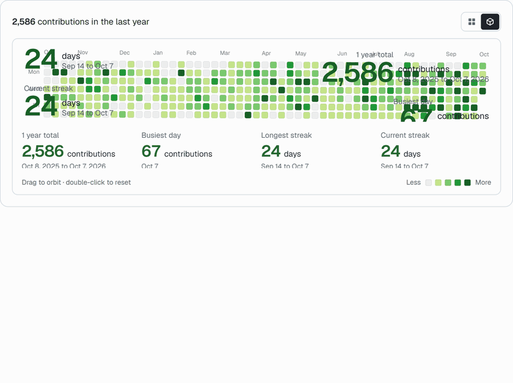

# Contribution Skyline

Contribution Skyline shows your GitHub contributions as a heat map that folds up into an interactive 3D skyline.
It runs on GitHub Pages and updates itself every day. You can deploy your own copy in about two minutes,
with no server and no code changes.

**Live:** https://moon-drakon.github.io/contribution-skyline/

<picture>
  <source media="(prefers-color-scheme: dark)" srcset=".github/assets/preview-dark.gif">
  
</picture>

## Make your own

1. Click **Use this template**, then **Create a new repository**. Keep it public.
2. In your new repository, open **Settings > Pages**. Set **Source** to **GitHub Actions**.
3. Open **Actions > Deploy site** and click **Run workflow**.

Your skyline goes live at `https://<your-username>.github.io/<repository-name>/`.
The workflow runs again every day at 00:30 UTC, so the page stays current.

If a run failed before you enabled Pages, run the workflow again after step 2.
To serve the skyline from the root of your user site, name the repository `<your-username>.github.io`.

## Personalize

The page reads your name and links from your GitHub profile:

- **Name:** your profile name, or your username if the name is empty.
- **Links:** your GitHub profile, website, social accounts, and public email.

To change them without editing code, add repository variables in
**Settings > Secrets and variables > Actions > Variables**:

| Variable | Example | Effect |
| --- | --- | --- |
| `DISPLAY_NAME` | `Ada Lovelace` | Replaces the profile name in the header and page title. |
| `EXTRA_LINKS` | `Resume https://example.com/cv.pdf` | Adds footer links, one per line, as `Label URL`. |

Run the workflow again to apply the change.

## What you can do

- Pick the last 12 months or any year with contributions. A link like `?year=2025` opens that year.
- Switch between the flat heat map and the 3D skyline.
- Hover or tap a day to see its count.
- Drag the skyline to orbit it. Double-click to reset the camera.
- Use the arrow keys to walk the grid, day by day.
- Hover a legend swatch to isolate one activity level.

## How it works

A GitHub Actions workflow runs every day. It reads the repository owner's profile and contributions
from the GitHub API, builds the site as a static export, and deploys it to GitHub Pages.
If an API call fails, the deploy stops and the last good version stays live.

| Part | Technology |
| --- | --- |
| Framework | Next.js 16 (static export), React 19, TypeScript |
| Styling | Tailwind CSS v4, shadcn/ui project structure |
| Data | `scripts/fetch-contributions.mjs`, GitHub REST and GraphQL APIs |
| Hosting | GitHub Pages, deployed by `.github/workflows/deploy.yml` |

## Credits

The 3D chart is based on the Contribution Skyline component by kedhareswer.
The year picker, data pipeline, template setup, and page are mine.

## Run locally

Requires Node.js 22. Any GitHub token works, and it needs no extra scopes.
With the GitHub CLI, you can use `$(gh auth token)`.

```bash
npm install
GITHUB_TOKEN=your_token GH_LOGIN=your_username node scripts/fetch-contributions.mjs
npm run dev
```

Open http://localhost:3000/.

`data/contributions.json` holds empty data in the repository. The workflow fills it
before each build, so the deployed site always shows current data.

If you deploy your own skyline, a star on this repository helps other people find it.
